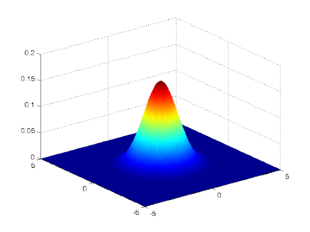
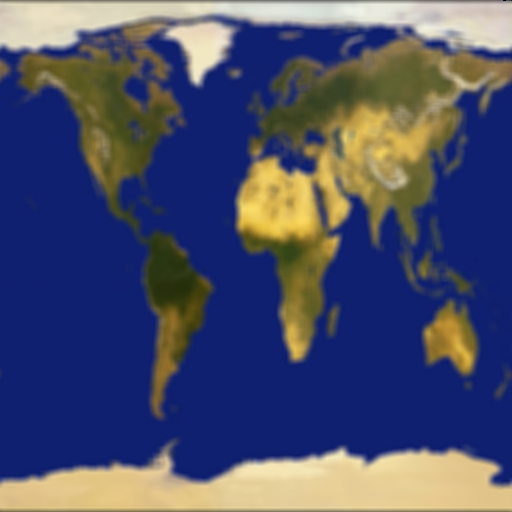
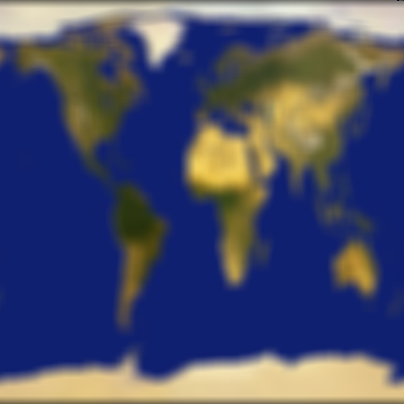
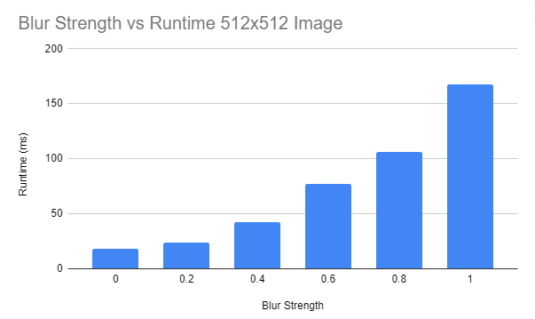

# Image Processing

Small console application written in C++ that takes a TGA image as input, applies a variable Gaussian Blur effect to the image and saves the modified image as a new TGA file.

## Development Environment

This program was developed in Visual Studio 2022 v17.7.4 using the C++20 standard.

External Dependencies: None.

## Usage

ImageProcessing is a console application that reads it's command line arguments at launch, it does not prompt the user for any input.
It takes three arguments:

- ```<PathToInputImage>``` Path/filename of an input TGA image.
- ```<PathToOutputFile>``` Path/filename of the output TGA image.
- ```<BlurStrength>``` A value between 0-1 inclusive indicating how strong the blur effect should be. Higher number gives a stronger blur effect.

If a file path has spaces, please surround the path with " ".

Example usage:

```
.>ImageManipulation.exe earth.tga earth_blurred.tga 0.5
```

## Design / How It Works

The functionality of this application is entirely contained in the `TgaImage` module and `Effects` class.

The `TgaImage` module is responsible for importing a TGA image from disk, parsing the file into internal fields in memory based on the TGA specification, and saving the image back out to disk.

The `Effects` class is a static class of effects that can be applied to a TGA image. Currently only GaussianBlur is implemented, but the class was designed to be easily expanded with more effects.

The `Effects::GaussianBlur()` method is a straightforward implementation of the Gaussian blur/smoothing algorithm which calculates a 2D matrix of weighted values (the 'kernel'). This kernel is then "slid" over the image with the target pixel at the center. The values in the kernel are used to take a weighted average of all the values of the neighboring pixels. That average value is then applied to the target pixel. This is what creates the blurring effect. The method takes takes a `TgaImage` and a `BlurStrength` value as parameters.

In Gaussian Blur, the strength of the blur effect is primarily affected by two values in the Gaussian formula: 

$$G(x,y) = {1 \over 2\pi\sigma^2}{e}^{{-}{x^2+y^2 \over 2\sigma^2}}$$

Where $x$ is the horizontal distance from the origin (target pixel), $y$ is the vertical distance from the origin (target pixel), and $\sigma$(sigma) is the standard deviation of the Gaussian distribution. 

Taking $x - (-x)$ gives us the width of the kernel that we will use to apply the effect to the image. A bigger kernel creates a stronger blurring effect because more pixels are being considered in the average but also increases the number of operations per pixel.

The value of $\sigma$ alters the blurring effect by determining to what degree pixels further away from the target pixel influence the average being calculated. $\sigma$ represents a standard deviation from the center, forming a standard bell curve. If the bell curve were three-dimensional and you could view it from top-down you would see a circular "spike" with values flattening out at the edges:



Source: https://aryamansharda.medium.com/image-filters-gaussian-blur-eb36db6781b1

Decreasing $\sigma$ will make the spike smaller in diameter and the falloff steeper, therefore causing pixels further away have less influence on the average. Whereas increasing $\sigma$ makes the spike larger in diameter and the falloff slower, therefore pixels further away have a larger contribution to the average compared to a smaller $\sigma$.

In `Effects::GaussianBlur()` we choose reasonable maximum values for `radius` and `sigma`, those values are then multiplied by the `BlurStrength` passed in by the user where 0 is no blur and 1 is the maximum blur applied:

```C++
// Scale the radius of the blurring effect by blurAmount, but we always want a radius of at least 1.
// A value of 10 is chosen here as a reasonable maximum value of the radius to get a near-unrecognizable image at blurAmount = 1.
int32_t radius = std::max((int)round(10 * blurAmount), 1);

// Scale the sigma value by the blurAmount, but we always want a sigma of at least 1.
// A value of 10 is chosen here as a reasonable maximum value for sigma to get a near-unrecognizable image at blurAmount = 1
float sigma = std::max(10.0f * blurAmount, 1.0f);
```

`kernelWidth` is calculated as a function of `radius` but we always want to make `kernelWidth` odd because we always need to have a center "target" pixel:

```C++
// Kernel width is a function of the radius passed in.
// But we always want a width of at least 3, and width should be odd so there is always a center pixel.
size_t kernelWidth = std::max(((2 * radius) + 1), 3);
```

There are many other methods of choosing `sigma` and `kernelWidth`, I chose these values based on trial and error testing and getting good results while maintaining a reasonable runtime performance.

### Edge handling

One of the challenges of applying the Gaussian Blur effect is how to handle pixels at the edge. If a target pixel is at the edge of an image then much of the kernel will try to sample pixel values that are outside the image and therefore invalid. There are many approaches to handling this including: reflection, filler pixels, ignoring pixels that lie outside x - radius and y - radius, etc. 

In this application I have chosen to omit the calculation of pixels outside the image. If the kernel attempts to sample a pixel outside the image then the value of that pixel does not contribute to the average and we continue processing other pixels under the kernel. The result of this can cause some pixels at the top and bottom edges of the image to appear darker than the source image. This is because the average that was calculated for that pixel will sum to less than the total intensity of the source pixel. This is a known issue and is something to improve upon in the future. 

## Results

The results of passing in various values for the BlurStrength can be seen here:

Original Image:


BlurStrength = 0.2:


BlurStrength = 0.4



BlurStrength = 0.6


BlurStrength = 0.8


BlurStrength = 1.0



## Areas for Improvement

Possible ways to enhance/expand this application in the future include:
- **Full TGA support**. Currently this application only supports uncompressed color-mapped and true-color TGA files. Whereas the full tga specification includes 6 possible formats.
- **More image effects**. Gaussian Blur is only one of several techniques for blurring an image. Support for other effects such as brightness, saturation, sharpening, noise reduction, lense distortion, etc. could also be added to the Effects class.
- **Support more image formats**. Currently this application only supports uncompressed color-mapped and true-color TGA images. Support could be added for tif, png, jpg, gif, etc. in the future.
- **GUI**. Using a GUI library such as DearIMGui would allow the user to see a preview that the effect had on the image before saving it out to a file.

## Performance Enhancements



This chart shows the runtime performance of the Gaussian Blur effect on the earth.tga 512 x 512 image shown above as BlurStrength increases. As expected, the runtime is exhibiting exponential behaviour as the current implementation is a straightforward application of the Gaussian Blur algorithm which has a runtime complexity of $O(ImageW * ImageH * KernelW^2)$.

There are many things we can do to improve this performance, including:
- **Gaussian Blur operation is separable in the x and y axis**. Currently this application applies the Gaussian kernel as a 2D matrix per pixel which has a runtime complexity of $O(ImageW x ImageH x KernelW^2)$. Since each pixel operation is necessarily independent of neighboring pixels we can apply a 1D kernel to pixels in the X axis followed by applying a 1D kernel to all pixels in the Y axis. The resulting effect is equivalent. Separating the X and Y axis operations gives us a slightly improved runtime complexity of $O(ImageW x ImageY x 2KernelW)$ = $O(ImageW x ImageY x KernelW)$.
- **Gaussian Matrix as Lookup Table**. Currently this application calculates a new Gaussian kernel for each image based on the radius, sigma, and BlurStrength settings. While the Gaussian matrix is typically much smaller than the image itself, calculating the values still involves many operations. If reasonable default values were selected for radius and sigma then the matrix could be calculated and stored ahead of time as a lookup table that the Gaussian algorithm could then reference. This would yield a moderate performance increase. 
- **Multithreading**. This application is currently single threaded on the CPU. Since each pixel operation is necessarily independent of any neighboring pixels, the image can be divided into smaller chunks which can then be dispatched to worker threads to process in parallel. This would significantly reduce the runtime on larger images.
- **GPU**. Similar to the note about multithreading, modern GPUs are massively parallel by design and are therefore well suited to performing many independent tasks in parallel. The image can be divided into smaller chunks and sent to the GPU for parallel processing. This would significantly reduce the runtime on larger images.

## Sources/Reference Material

[The TGA Specification](https://www.dca.fee.unicamp.br/~martino/disciplinas/ea978/tgaffs.pdf)

[Image Filters: Gaussian Blur](https://aryamansharda.medium.com/image-filters-gaussian-blur-eb36db6781b1)

[Efficient Gaussian blur with linear sampling](https://www.rastergrid.com/blog/2010/09/efficient-gaussian-blur-with-linear-sampling/)

[TGA File Format Summary](https://www.fileformat.info/format/tga/egff.htm)

[Wikipedia: Truevision TGA](https://en.wikipedia.org/wiki/Truevision_TGA)

[Wikipedia: Gaussian Blur](https://en.wikipedia.org/wiki/Gaussian_blur)
